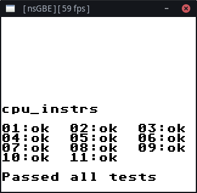

<!--
SPDX-FileCopyrightText: 2021 Noeliel <noelieldev@gmail.com>

SPDX-License-Identifier: LGPL-2.0-only
-->

# nsGBE
**N**o **S**pecial **G**ame **B**oy **E**mulator is a work-in-progress interpreting Game Boy (Color) emulator written in C, targeting POSIX.  
Its feature set is limited but it is able to run some original Game Boy (DMG) and some Game Boy Color (CGB, experimental) games that use no MBC or MBC3/5.  
All of the Pokémon games have been tested and confirmed to be perfectly playable without any obvious issues.  
APU / audio support is missing and has low priority.  
The PPU implementation is sloppy and high level, very roughly following an approach outlined on [Imran Nazar's Blog](https://imrannazar.com/GameBoy-Emulation-in-JavaScript:-Graphics).  
I'm hoping to be able to replace this with a more accurate pixel FIFO at some point.  
Development generally favors compatibility over accuracy and performance.

## Give it a try

You can find browser-based versions of nsGBE hosted on my website.  
[WebAssembly variant](https://nsgbe.noeliel.com/wasm/) (better performance but requires your browser to support WebAssembly.)  
[JavaScript variant](https://nsgbe.noeliel.com/js/) (better browser compatibility but worse performance.)

Please note that you will have to supply your own ROM files.  
Also, this application runs entirely on your local machine in your browser, so no files are uploaded to any server at any point in time.

## Building (native)

Currently, the project provides gui implementations based on GTK+ 3.0 (Cairo) and SDL2 targeting Linux.  
Windows and macOS are not officially supported, but the browser-based variant works on those.  

Run `$ ./configure-gtkplus` to generate build files for GTK+ using CMake.  
Alternatively, run `$ ./configure-sdl2` to generate build files for SDL2.  
Then, run `$ ./build` to compile. This will produce `nsgbe` in `out/`.

**Note:** To use Clang instead of your default C/C++ compiler (likely GCC if you're on Linux), run `$ export CC=/usr/bin/clang` and `$ export CXX=/usr/bin/clang++` (adjust paths if necessary) prior to executing the `configure-*` script.

## Usage

Launch the program by running `$ nsgbe <path/to/rom.gb>`  
Make sure the directory containing your rom file is writable if you wish to be able to save the battery (savegame) upon quitting.

Joypad keys are hardcoded right now. They're mapped as follows:

| Keyboard key | Console key |
| --- | --- |
| W | Up |
| A | Left |
| S | Down |
| D | Right |
| K | A |
| O | B |
| L | Start |
| P | Select |
| Spacebar (hold) | Overclock x4 |

You can customize these to your liking in `app/*/window.c`.

## Test Rom Results

## Porting

Porting to different platforms (like Windows) should be possible without too much trouble; you'll mainly have to provide alternative implementations for gettimeofday() (used in `emu/clock.c` for example) and threading, since these are POSIX-specific and may not be available everywhere.  
Speaking from experience, working with bitfields (which especially `emu/cpu.c` makes heavy use of) can be very compiler-specific, so I'm not sure how well cl.exe receives that (maybe give Clang on Windows a try).
macOS should be a little easier to target–it's probably just a matter of getting the build files to work.  
I've also managed to build an Android app that incorporates the nsGBE core as a native library and talks to it via ffi, which was very straightforward.
I may or may not release this Android frontend at some point in time, although I would first need to clean up the glue code and the Java side of things as well as make the app a little more user-friendly.

## License

Most of the code contained in this repository is licensed under the LGPL-2.0-only SPDX identifier.  
For more information on individual files, check the file's header or any accompanying *.license file (such as with images or other blobs). 
